# Pets-Care-FrontEnd

- This web App was create for tablets resolution 1024 x 768 px,
- This Web App was built with React and Redux. 
- This is the Front End App of the Vet Care Medical Center.
- All the users can create new appointments in the differents services for their pets.
- The Admin users can create and delete services.
- The Admin and Employe users can check the appointmets of each service.
- In the future Admins and Employes will have a disccount for their pets' appointments.
- The Admin Sign Up route is hidden for only Admins and Employes users "/adminsignup".
- Each type of user have a different Dashboards.
- The Front End Comunicate to the Back End Server.

## Future Improvements
- Responsive Resolutions.
- Native App. 

## App Demo Use

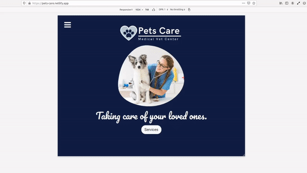

## ScreenShots

### Landing
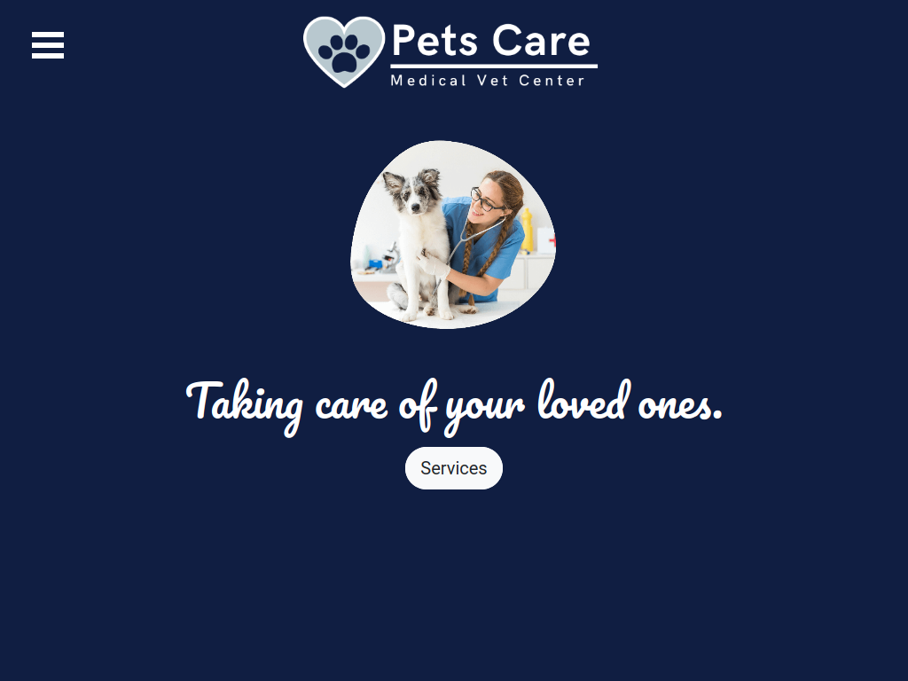

### Admin Sign up
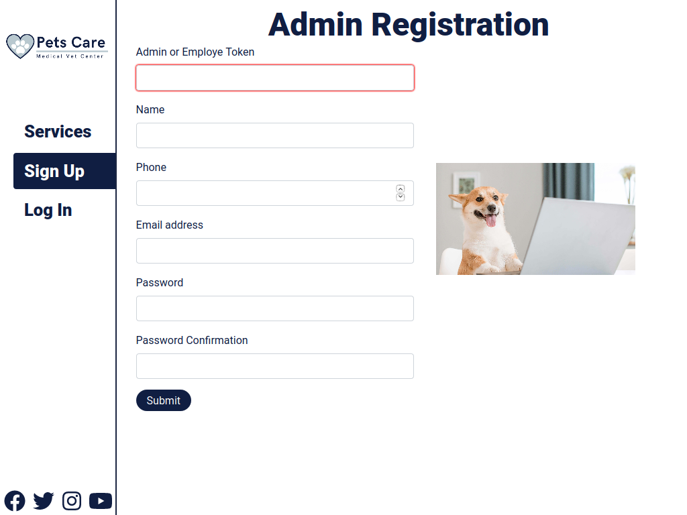

### Clients Sign up
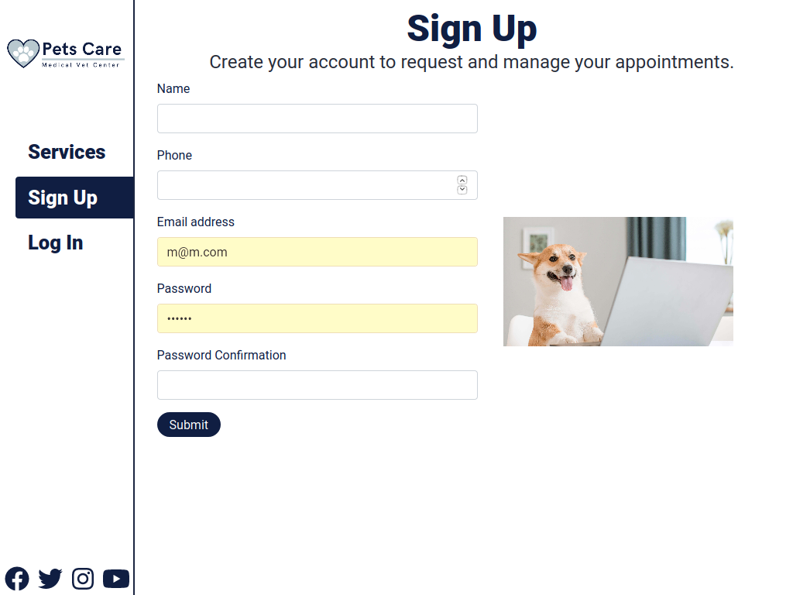

### Users Sign in
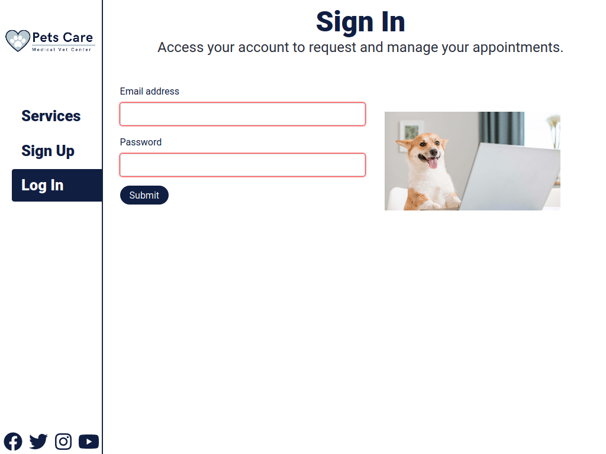

### Appointment Form
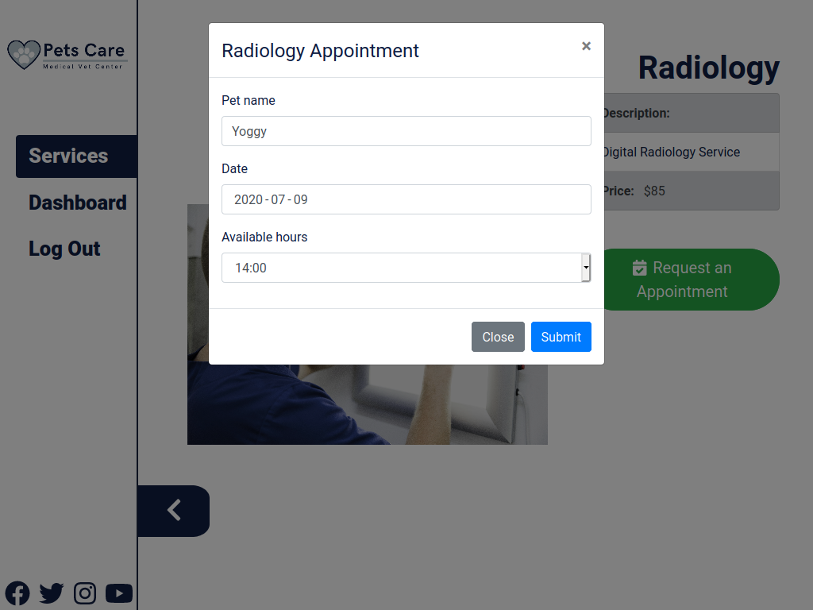

### Admin Dashboard Services
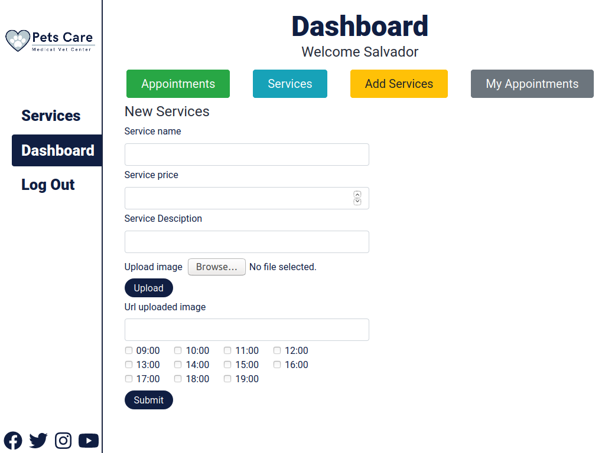

### Admin Dashboard Services
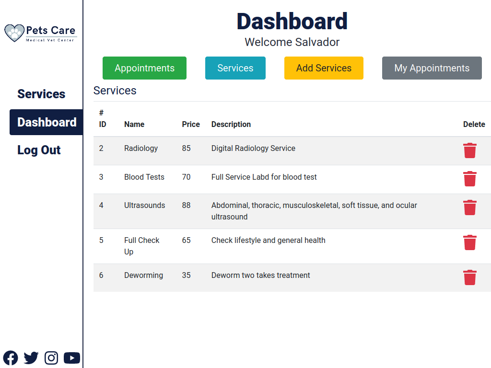

### Employes Dashboard
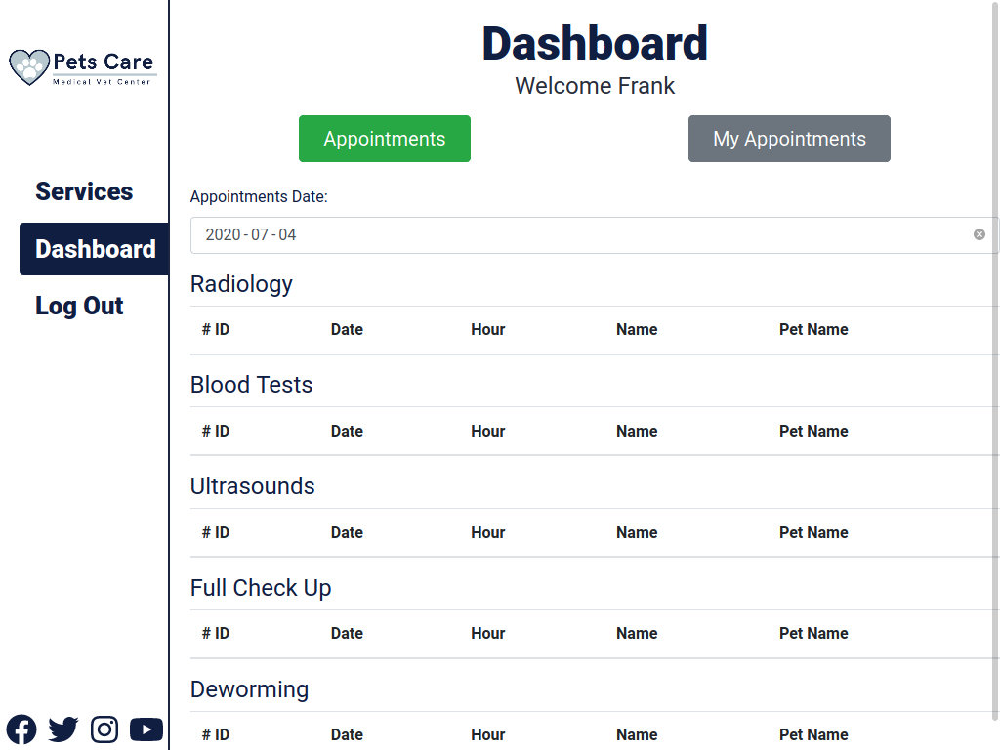

### Client Dashboard
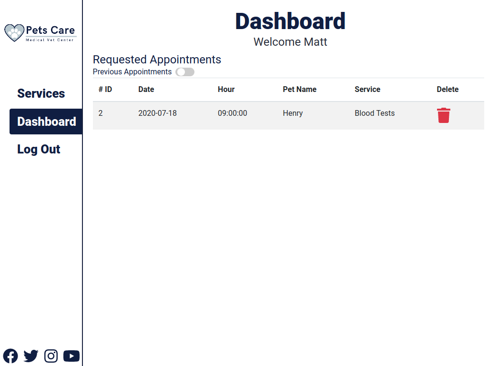

### Services
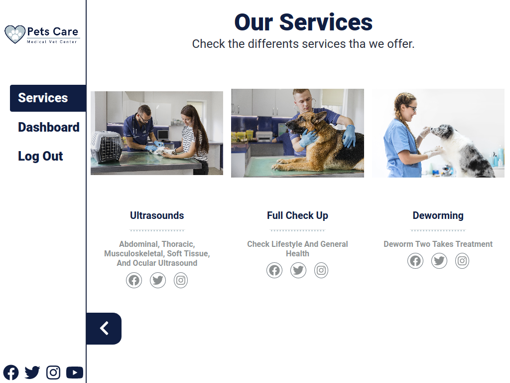

### Show Service
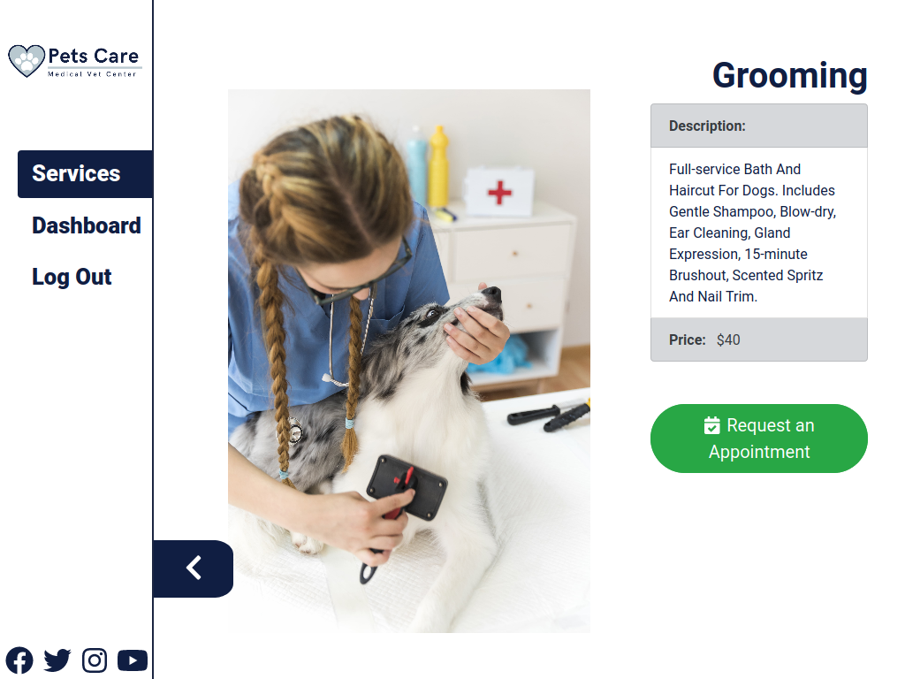


## Live Version

Live version [here](https://pets-care.netlify.app).

## How to use it

You can use this app [online](https://pets-care.netlify.app).

Or you can get a local copy up and running follow these simple steps.

Download the project with
```
$ git clone https://github.com/Salvador-ON/Pets-Care-FrontEnd.git
```
Also you can download the project from this [link](https://github.com/Salvador-ON/Pets-Care-FrontEnd).


Before running the app you also need to download the Ruby on Rails [Back End application](https://github.com/Salvador-ON/Pets-Care-BackEnd-Api).

Also you need to change the domain of all the urls to http://localhost:3000

To start the app. You need to have installed node.js and npm. [Check here](https://www.npmjs.com/get-npm)

Then go to the folder at the terminal an run 

```
npm start
```


## Author

**Salvador Olvera**
- Linkedin: [Salvador Olvera](https://www.linkedin.com/in/salvador-olvera-n)
- Github: [@Salvador-ON](https://github.com/Salvador-ON)
- Twitter: [@Salvador Olvera_ON](https://twitter.com/Salvador_ON) 

## Used Tools

- HTML.
- CSS.
- React.
- Redux.
- JavaScript.
- Bootstrap.
- Rails API (Back End).
- Google Firebase Storage.

## Setup

## Available Scripts

In the project directory, you can run:

### `yarn/npm start`

Runs the app in the development mode.<br />
Open [http://localhost:3000](http://localhost:3000) to view it in the browser.

The page will reload if you make edits.<br />
You will also see any lint errors in the console.

### `yarn/npm test`
